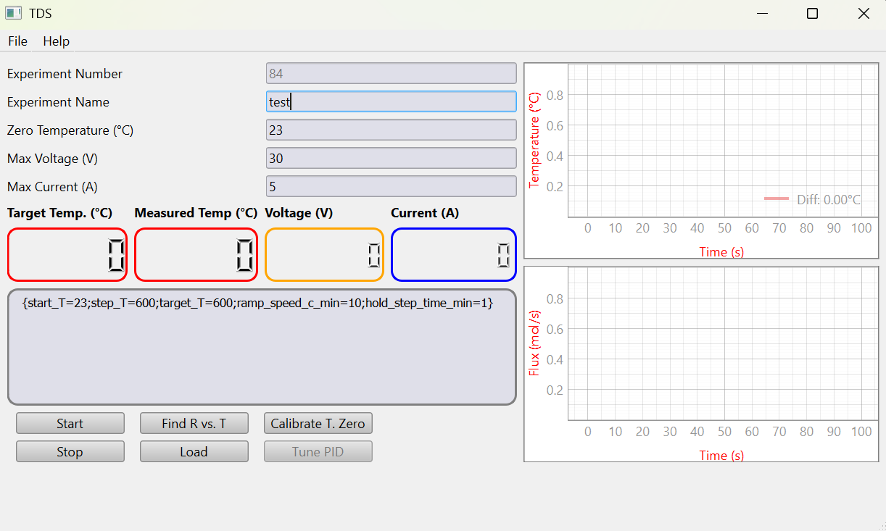
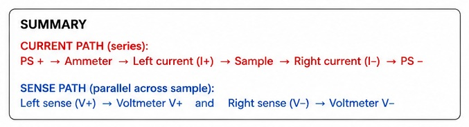

# TDS Control Software

Desktop software for running a temperature-programmed resistivity experiment with:

- one Siglent power supply,
- one DMM for voltage,
- one DMM for current,
- a loaded resistivity-vs-temperature calibration curve.

The application is written with PyQt6 and PyVISA. It controls the power supply, estimates sample temperature from resistance, follows a temperature program, and saves data continuously while the experiment is running.





## Wiring: required four-wire (Kelvin) connection

Use a true Kelvin connection. The current path and voltage-sense path must be separate all the way to the sample:

```text
                                  CURRENT PATH
PS+ -- Ammeter -- force cable -- o======== SAMPLE ========o -- force cable -- PS-
                                  |                        |
                              V+ sense                  V- sense
                                  \                        /
                                   \---- voltage DMM -----/
                                      high-impedance sense wires
```

- `DMM_i` is the ammeter in series, so all source current flows through it and the two force leads.
- `DMM_v` is the voltage DMM. Connect its `V+` and `V-` leads directly to the sample, ideally to separate sense contacts inside the current contacts.
- Do **not** connect the voltage DMM at the power-supply ends of the cables, at the ammeter terminals, or at other points outside the sample contacts.
- The voltage DMM draws negligible current, so the resistance of its own sense wires is practically irrelevant.

With cable-end/two-wire voltage sensing, the reading includes unwanted lead and contact resistance:

```text
R_measured = R_sample + R_contacts + R_cables
```

With the required Kelvin connection, the voltage DMM measures the sample drop:

```text
V_DMM ≈ I × R_sample
R_sample = V_DMM / I
```

Do not connect the current meter in parallel across the sample, because that can short the source and damage the setup. Keep `fixed_series_resistance_ohm = 0` for a Kelvin measurement unless a real, separately verified series component must be removed from the calculation. The loaded `R vs. T` calibration must represent the same Kelvin sample resistance.

See [the measurement setup guide](docs/MEASUREMENT_SETUP.md) for the wiring checklist and the prohibited two-wire layout.

## Features

- Load an `R vs. T` file from `.xlsx` or `.csv`
- Auto-load the selected file immediately after `Find R vs. T`
- Reload the same file later with `Reload R vs. T`
- Calibrate the room-temperature `T0` reference against the loaded curve
- Tune conservative PI/PID gains from a low-rise step test before the experiment
- Run stepped ramps or a simple continuous ramp
- Live plots for temperature and flux placeholder
- Continuous background autosave to:
  - `data.csv`
  - `data.h5`
  - `r_vs_t.csv`
- Close confirmation when exiting the GUI

## Requirements

Install Python packages from [requirements.txt](requirements.txt):

```bash
pip install -r requirements.txt
```

The project currently depends on:

- `pyqt6`
- `pyvisa`
- `pyvisa-py`
- `pandas`
- `openpyxl`
- `h5py`
- `scipy`
- `pyqtgraph`

You also need working VISA access for the connected instruments.

## Configuration

The instrument addresses and control defaults now live in [files/config.toml](files/config.toml).

This file uses TOML instead of JSON so comments can be kept directly in the file.
Each setting has a short explanation above it to make hand-editing easier for normal users.
If you still have an older `files/config.json`, the app will import it automatically the first time and write a new `config.toml`.

Important fields:

- `controller_mode`: choose `"PI"` or `"PID"`
- `experiment_mode`: choose `"CONTROLLED"` or `"CURVE_SWEEP"`
- `DMM_v`: VISA address for the voltage DMM
- `DMM_i`: VISA address for the current DMM
- `PS`: VISA address for the power supply
- `experiment_frequency`: control loop frequency in Hz
- `max_voltage`: absolute software voltage limit
- `max_current`: absolute software current limit
- `dmm_voltage_range_v`: explicit fixed voltage-DMM range; default `20 V`
- `dmm_current_range_a`: explicit fixed current-DMM range; default `0.2 A`
- `dmm_synchronized_reading`: start both DMM conversions before fetching either value
- `startup_settle_time_s`: short delay after applying Initial Voltage before control begins
- `low_voltage_max_step_up` / `low_voltage_max_step_down`: fine controller steps used near zero voltage
- `t0_voltage_search_start`: starting voltage for the `T0` search
- `t0_calibration_voltage`: highest voltage the `T0` search is allowed to use
- `t0_settle_time_s`: how long the wire is allowed to settle before `T0` samples are accepted
- `tuning_start_voltage`: starting voltage for the PI/PID tuning search
- `tuning_search_max_voltage`: highest voltage the PI/PID tuning search is allowed to use
- `tuning_response_voltage_step`: how much each PI/PID tuning attempt increases above the safe baseline voltage
- `curve_sweep_voltage_step`: basis used to derive the number of open-loop sweep steps from the GUI `Max Voltage`

### Fixed DMM range policy

Auto-ranging must remain **off** on both DMMs. Before power-supply output is enabled, the software locks the
meters to the explicit `dmm_voltage_range_v` and `dmm_current_range_a` settings. The defaults are the SDM3055
`20 V` voltage range and `0.2 A` current range. The wider voltage range prevents overload in higher-voltage wire
experiments, while the fixed current range preserves the intended current measurement behavior.

With `dmm_synchronized_reading = true`, the software sends `INIT` to both DMMs before fetching either result.
This greatly reduces the time offset that occurs when two blocking `READ?` commands are executed sequentially.
If synchronized acquisition is unavailable, that individual sample falls back to the older `READ?` method and
prints a warning.

Choose the smallest supported fixed ranges that cover every expected sample voltage and current. If the signal
can exceed either default range, raise that DMM setting before the run. `max_voltage` and `max_current` remain
independent software safety limits; the power supply must also have an appropriate hardware current limit/OCP.
Do not enable Auto Range manually during calibration, tuning, or an experiment.

### Low-voltage startup policy

The GUI `Initial Voltage` is shared by T0 calibration, PI/PID tuning, curve sweep, and controlled experiments.
It is an enforced runtime floor: the controlled experiment starts directly at this voltage and cannot request a
lower value. There is no separate experiment-start measurement search. After `startup_settle_time_s`, the normal
controller loop reads the meters and increases, holds, or decreases voltage from live measurements, while the
Initial Voltage floor remains enforced. At or below `low_voltage_step_threshold`, controller, recovery, T0-search,
and tuning-search actions use the finer low-voltage step sizes.

Logged `PSU command` values are requested power-supply setpoints. They are not the same as `Vsample`, which is the
Kelvin voltage measured directly across the wire, and either value may differ slightly from the PSU front-panel
readback because of output accuracy, display resolution, settling, and wiring voltage drop.

The programmed temperature target starts from calibrated T0 and advances according to `ramp_speed_c_min`.
Reaching `start_T` changes the ramp phase but does not wait for the measured temperature, so noisy or lagging
measurements cannot freeze the target. Deliberately configured step holds still pause the target as requested.

At low PSU voltage, one large inferred-temperature jump cannot replace calibrated T0 or the last trusted
temperature. The controller initially holds its present voltage while checking the candidate and requires
`low_signal_jump_confirm_samples` matching temperature-and-resistance readings (default `3`). If the jump is not
confirmed, subsequent invalid readings continue from the prior trusted temperature instead of reusing the spike.
This confirmation does not pause the programmed target ramp.

If low-signal readings remain invalid, the controller no longer stays indefinitely at Initial Voltage. After five
consecutive invalid readings it increases the commanded PSU voltage by `0.01 V`, observes five more measurements,
and repeats when necessary. It performs up to five upward probes in one recovery episode, while still enforcing
`max_voltage`, `max_current`, and the Initial Voltage floor. One valid measurement resets this recovery sequence;
the programmed temperature target continues to ramp throughout it.

Controller mode notes:

- `controller_mode = "PI"` is the default and recommended starting point
- set `controller_mode = "PID"` if you want derivative action enabled
- the `Tune PI/PID` button uses the selected mode from `config.toml`

Experiment mode notes:

- `experiment_mode = "CONTROLLED"` is the default mode
- `CONTROLLED` uses the loaded `R vs. T` curve, `T0` calibration, and PI/PID control to follow the programmed temperature path
- `CURVE_SWEEP` keeps `Calibrate T. Zero` available and requires it before `Start`, disables `Tune PI/PID`, ignores the experiment-program text box, and performs an open-loop voltage sweep
- in `CURVE_SWEEP`, the sweep starts from `curve_sweep_start_voltage` and ends at the smaller of the GUI `Max Voltage` and the software limit from `config.toml`
- the number of sweep points is calculated automatically as `ceil(Max Voltage / curve_sweep_voltage_step)`
- the loaded `R(T)` curve is used only to shape the voltage progression, not to claim a true physical `V(T)` law
- the shaping idea is simple: the software samples the loaded curve across temperature, converts that sampled curve into normalized fractions, and then maps those fractions onto the voltage range so the early and late parts of the sweep follow the same general order as the calibration curve
- `T0` calibration rescales that curve to the actual four-wire resistance of the current wire, so the live `R -> T` conversion uses the current wire rather than the unscaled reference values

The software also stores tuned controller gains and autosave defaults in this file after you run the GUI.

## R vs. T File Format

Accepted input:

- Excel `.xlsx`
- CSV `.csv`

Required columns:

- `resistivity`
- `temperature [C]`

Also accepted for reloads created by this app:

- `temperature`

## Running the GUI

Start the application with:

```bash
python -m tds_control
```

or keep using the compatibility launcher:

```bash
python TDS.py
```

## Typical Workflow

1. Click `Find R vs. T` and select the calibration file.
   The file is loaded automatically.
2. Check the `Zero Temperature (°C)` value.
   This should be the actual room or base temperature.
3. Click `Calibrate T. Zero`.
   This rescales the loaded resistivity curve so the measured low-voltage room-temperature resistance matches the entered `Zero Temperature`.
4. Optional: click `Tune PI/PID`.
   The software performs a guarded low-voltage step test with a small temperature rise and stores the tuned gains in `files/config.toml`.
   By default this tunes a PI controller because `controller_mode = "PI"` is the default.
5. Enter the experiment program in the text box.
6. Confirm the four-wire Kelvin contacts and set positive, conservative `Max Voltage` and `Max Current` limits. Verify both DMMs are on fixed DC ranges, not Auto Range.
7. Set an independent current limit/OCP on the power supply.
8. Click `Start`.

For `CURVE_SWEEP` mode:

1. Click `Find R vs. T` and select the calibration file.
2. Choose `CURVE_SWEEP` in the `Experiment Mode` selector.
3. Enter the actual equilibrated wire temperature in `Zero Temperature` and click `Calibrate T. Zero`.
4. Confirm the four-wire Kelvin contacts, set the GUI `Max Voltage` and `Max Current`, and verify both DMMs use fixed ranges.
5. Set an independent current limit/OCP on the power supply.
6. Click `Start`.

In this mode the program text box is disabled because the sweep shape comes from the loaded curve and the sweep resolution comes from `curve_sweep_voltage_step`.

## Experiment Program Format

The text box accepts one line per experiment step.

Example:

```text
{start_T=23;step_T=600;target_T=600;ramp_speed_c_min=10;hold_step_time_min=1}
```

Meaning:

- `start_T`: temperature where the programmed sequence begins
- `step_T`: step size in degrees C
- `target_T`: final temperature target
- `ramp_speed_c_min`: target ramp speed in degrees C per minute
- `hold_step_time_min`: hold time at each step in minutes

Behavior:

- If `step_T >= target_T - start_T`, the program becomes a simple ramp.
- Otherwise the loop ramps to each intermediate step, holds for the requested time, and stops as soon as the final plateau is reached.

## Safety Behavior

The control loop now includes:

- voltage step-up and step-down limits
- PID anti-windup
- rate limiting when temperature rises too quickly
- software current cutoff using `max_current`
- invalid-measurement detection
- direct controlled startup at the enforced Initial Voltage floor
- time-driven target advancement at the configured ramp speed
- repeated confirmation before a large low-signal reading replaces T0 or the last trusted temperature
- five staged `+0.01 V` recovery probes when invalid low-signal measurements would otherwise stall control
- an enforced Initial Voltage floor and 0.001 V low-voltage micro-steps
- controlled micro-voltage probing before a large resistance/temperature jump is accepted
- one PSU output-enable command at operation start, followed by a 0.001 V keep-alive setpoint at the end

`max_current` is a software stop threshold after the current DMM is read; it is not a hardware current limiter. Set an independent current limit/OCP on the power supply before each run. Even with these protections, first runs on a new sample should be done with conservative limits and supervision.

When an inferred-temperature jump is at least `measurement_jump_probe_threshold_c`, the controller does not immediately trust it. An upward jump causes a small PSU decrease; a downward jump causes a small increase only while the measured current is safely below `max_current`. Follow-up temperatures must remain inside the fixed window centered on the first probe candidate (default +/-50 C), and resistance must also be consistent before a new reference is established. The reference window does not move when a sample is inconsistent. By default, an unstable probe may try for 20 cycles before stopping rather than continuing with stale data.

## Data Output

Each run creates a folder like:

```text
data/<experiment_counter>_<experiment_name>/
```

Saved files:

- `data.csv`: continuously appended human-readable data file
- `data.h5`: continuously appended HDF5 data file
- `r_vs_t.csv`: the exact calibration curve used for that run
- `calibration_info.txt`: written when T0 calibration detected a large raw curve-to-T0 mismatch

Autosave runs in a background thread so disk writing does not block experiment control.

## Notes on Calibration

### `Calibrate T. Zero`

This function does not shift the temperature setpoint directly.
It measures the sample resistance near room temperature and rescales the loaded resistivity curve so the measured room-temperature point matches the entered `Zero Temperature`.
For the current wire, it constructs `R_cal(T) = R0 * rho_ref(T) / rho_ref(T0)` and then uses that calibrated `R(T)` curve for the live resistance-to-temperature conversion.

During this step the software now:

- starts at `t0_voltage_search_start` and increases in bounded micro-steps until both current and resistance are stable,
- never goes above `t0_calibration_voltage` during that search,
- waits `t0_settle_time_s` before collecting data,
- treats the entered `Zero Temperature` as the calibration anchor instead of rejecting samples based on the uncalibrated curve,
- shows and records a warning when the raw inferred temperature differs from T0 by more than `t0_max_temp_error_c`,
- uses nine synchronized voltage/current pairs by default,
- discards warmup readings and rejects invalid resistance/current readings or robustly detected resistance outliers before calculating the final scale,
- reports the temperature-equivalent spread of the accepted T0 resistances and warns when it exceeds `t0_temperature_spread_warning_c`.

The T0 value printed for accepted calibration samples is the entered anchor temperature, not an independent
temperature measurement. For a low-TCR wire, use the reported equivalent spread to judge whether the electrical
signal is precise enough for temperature control.

### `Tune PI/PID`

PI/PID tuning uses a guarded low-rise step response:

- it starts at `tuning_start_voltage` and increases in bounded micro-steps until both current and resistance are stable,
- it uses that lowest stable current-and-resistance voltage as a safe baseline voltage,
- it then applies a real step above that baseline and only increases the response voltage in bounded attempts up to `tuning_search_max_voltage`,
- it measures the baseline temperature before each response attempt,
- stops once the requested small temperature rise is reached,
- estimates conservative gains for the selected controller mode.

Mode details:

- `PI` mode is the default and leaves `Kd = 0`
- `PID` mode also estimates a conservative derivative term and uses it during the real experiment

This is intended to reduce aggressive heating before the real experiment starts.

### Bounded curve extrapolation

Curve extrapolation is disabled by default. In this safe configuration, the software accepts only experiment
temperatures covered by the loaded calibration curve and rejects an out-of-range program before opening the
instruments or enabling the PSU.

Setting `curve_extrapolation_enabled = true` explicitly extends a calibrated R-vs-T curve to the configured
`curve_extrapolation_min_temperature_c` and `curve_extrapolation_max_temperature_c` limits. Outside the
measured range, the software fits a straight line to at least `curve_extrapolation_fit_points` points at the
corresponding end. Each endpoint fit also covers at least `curve_extrapolation_min_fit_span_c`, so dense
tables do not create a false flat or reversed slope from only a tiny temperature interval.

Clean curves keep their original temperature resolution and receive only a least-squares monotonic correction
within `curve_extrapolation_max_monotonic_correction_ratio`. When `curve_smoothing_enabled = true`, a dense
curve that exceeds that limit can be recovered without modifying its source file: the software groups rows into
`curve_smoothing_temperature_bin_c` bins, uses the smallest centered-median window that works up to
`curve_smoothing_max_window_c`, and then applies a least-squares monotonic fit. Smoothing is allowed only for
files with at least `curve_smoothing_min_points` rows, and the 99th-percentile raw deviation must stay below
`curve_smoothing_max_residual_ratio` of the curve's total resistance span. The console reports the selected
window, correction, and residual whenever this recovery path is used.

The configured extrapolation limits remain 0 to 600 C, but they have no effect while extrapolation is disabled.
Extrapolated temperatures are estimates rather than measured calibration data and must not be used for
closed-loop heating unless they have been independently validated for the particular material and geometry.
The application rejects experiment targets outside the active conversion range. Use reference or measured data
covering the full experiment range whenever possible.

## Development

The main implementation now lives in the package directory:

```text
tds_control/
```

Key modules:

- `tds_control/app.py`: GUI and application entry point
- `tds_control/tds_experiment.py`: experiment loop and safety logic
- `tds_control/calibration.py`: `T0` calibration and PI/PID tuning
- `tds_control/data_saver.py`: background CSV/HDF5 autosave
- `tds_control/pid.py`: PID controller
- `tds_control/siglent.py`: instrument SCPI helpers

If you edit the Qt Designer file and regenerate Python code:

```bash
pyuic6 -x files/TDS.ui -o tds_control/app.py
```

If you regenerate `tds_control/app.py` from the `.ui` file, remember that manual logic changes in the Python file will be overwritten unless they are merged back in.
