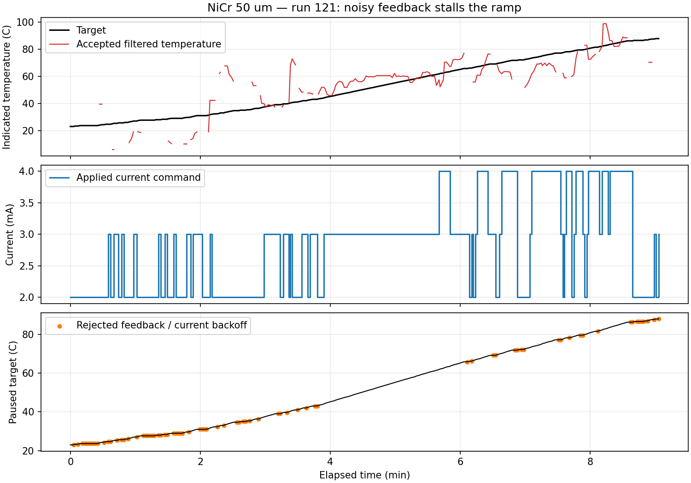

# Thin NiCr run 121

The profile was subsequently renamed to `NiCr_50` and its startup anchor
lowered to 1 mA. Use [the run 123 instructions](NICR50_RUN_123.md) for the
current files; the values below describe run 121 and its initial follow-up.

The automatic stop was the raw-temperature cutoff. The supplied traceback
reports `Measured temperature 773.86 C exceeded Maximum Temperature 600 C`.
The preceding saved readings were about 70-90 C. This strongly suggests a
V/I acquisition spike, but resistance-only data cannot establish the true
physical temperature. The 600 C cutoff remains active for every raw pair;
averaging must never hide an over-temperature reading.

The experiment lasted 543.43 s. Of 271 saved cycles, 195 were accepted and 76
were invalid/backoff cycles (28.0%). The final target was 87.94 C. Each rejected
reading reduced current toward 2 mA and paused the ramp. Commands repeatedly
cycled between 2, 3 and 4 mA. At these levels, a 1 mA step changes heating power
substantially. Accepted filtered readings ranged from 5.92 to 98.98 C and
tracking errors ranged from -20.56 to +34.40 C. The longest saved invalid streak
was eight, below the ten-cycle feedback-failure threshold; the traceback
identifies the separate over-temperature guard as the actual stop reason.

Run metadata used 5 A / 20 W limits, higher than the distributed thin NiCr
profile's 0.10 A / 0.50 W. Neither explains this stop. Raising electrical limits
cannot improve the resistance measurement. The profile keeps its existing
limits and 600 C target support.

## T0 and range selection

T0 reported 23.94 C of temperature-equivalent resistance scatter. A nominal
1 mA command produced about 1.44 mA median measured current during the final
calibration samples. A software command ceiling does not certify the supply's
actual current regulation at that setting.

The log shows the current meter changing from 2 mA to 20 mA after a 1.538 mA
reading. The measurement code reserved a full experiment current step of
headroom even during T0, where no heating step was pending. That caused an
unnecessary loss of meter sensitivity. T0 now uses no heating-step headroom
and its own 95% range-switch threshold. Real overload still triggers recovery.
T0 stays at a nominal 1 mA and averages nine paired readings per measurement.

## Changes for the next trial

Only the thin NiCr profile enables the new experiment options:

- Five synchronized V/I pairs per measurement; robust resistance outlier
  selection retains a strict majority, then averages matched V and I before
  converting their ratio to temperature. A failed majority remains invalid.
- Every raw pair retains electrical and temperature checks, including retries.
  The batch details are saved in `control_diagnostics.jsonl` so averaging and
  rejected points can be reviewed.
- Kp decreases from 0.00003 to 0.000015 A/C; Ki decreases from 0.0000003 to
  0.0000001 A/(C s), with Ti 150 s. Rate prediction is off because the noisy
  inferred rates caused extra downward corrections.
- A 0.2 mA hysteresis band beyond the normal half-step rounding boundary
  reduces PI command chatter. Integral corrections can accumulate across the
  band. Forced invalid-feedback backoff bypasses it.
- Current settling increases from 0.5 to 1 s. The nominal loop stays 2 s;
  longer batches/retries use actual elapsed time for controller updates.
- Temperature-mode runs save `run_outcome.json` with completion, user stop or
  error and its exact message. This is a separate file so CSV and diagnostic
  measurement rows remain aligned.

The current table and R(T) curve remain estimated. This short, noisy run does
not support updating the table through 600 C. Successful Ni settings are
unchanged; other profiles retain single-pair experiment measurements and no
added current hysteresis. The T0 headroom correction applies to all profiles.

Siglent's [SDM programming guide](https://siglentna.com/wp-content/uploads/dlm_uploads/2017/10/SDM-Series-Digital-Multimeter_ProgrammingGuide_EN02A.pdf)
describes INIT as starting acquisition and clearing old readings, with FETCh
waiting for completion. The existing paired-start sequence follows this
documented scheme. The data do not prove a stale-read firmware fault, so no
unsupported trigger commands were added.

Restart the updated app, load `NiCr_50_provisional`, load its matching NiCr R(T)
reference, and recalibrate with the wire fully cooled. First compare a ramp
to 100-150 C with a settled hold. Review T0 scatter before proceeding to the
higher estimated range. If a raw spike or large T0 scatter persists, check
Kelvin contacts and acquisition hardware; these software changes do not prove
smooth or physically accurate control through 600 C. Save the new folder,
especially `run_outcome.json` and the batch diagnostics.
