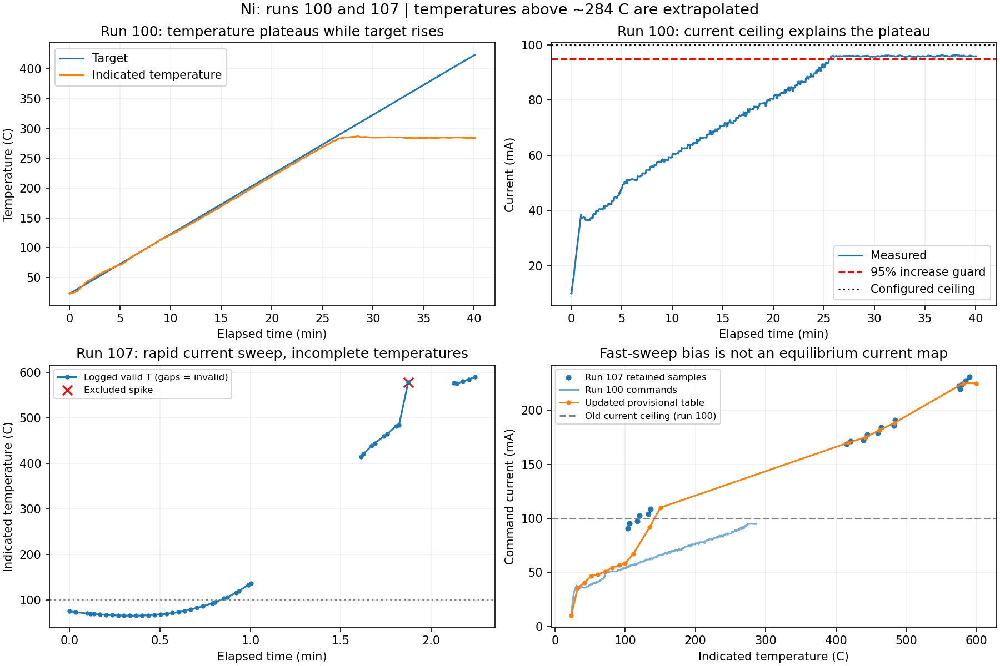

# Ni runs 100 and 107: table update and current-limit finding

## What run 100 shows

All 1,197 diagnostic records were accepted. In the target range 200-275 C,
measured-minus-target error averaged -3.530 C with 0.457 C standard deviation.
At target 279.912 C, measured current first reached 95.930 mA and indicated
T was 274.534 C. The controller prohibits further increases at 95% of its
0.100 A ceiling. Command then remained at 0.095 A, with temperature settling
near 284 C while target continued to 423.646 C. This is actuator saturation,
not evidence that increasing PI gains would solve the late deviation.

The constant old feed-forward above 111 C contributed to earlier tracking lag,
but replacing the table alone cannot overcome the electrical ceiling.
PI gains, slew steps, filtering and safety guards are retained. The controller
now prints CURRENT LIMIT on entry and records the current-limit state and
thresholds in control_diagnostics.jsonl so saturation is explicit.

## How run 107 was used

The metadata identifies the Ni profile lineage and a CURRENT-mode ramp of
0.1 A/min. Both new runs have the same exported R(T) source hash. No new NiCr
measurements were supplied; NiCr is unchanged.

The Ni table and its interpolation through 100 C are preserved by inserting
an exact 100 C boundary anchor. Only finite, positive T/I/current-command/power
records above 100 C and at or below 600 C are used. Missing temperatures are
not reconstructed. CSV data row 55 (zero-based, file line 57) is excluded:
it jumps from about 484 to 578 C, is followed by six invalid temperatures,
and then readings return to about 576 C at a substantially higher current.

19 accepted rows remain. They are grouped in 25 C temperature bins, using
mean indicated temperature and RMS command C_V. Each bin retains its source
row indices. From 100 to 150 C the new bias blends from the old 100 C anchor
to the current-ramp estimate; this avoids an abrupt junction at 100 C. The
150 C point is interpolated. Above that, interpolation joins the binned points.
The 600 C endpoint holds the last binned current (0.225035369 A), and is not
a measured 600 C point.

There are no valid samples between 136.433 and 415.366 C or between 484.107
and 575.485 C. Those intervals are explicitly interpolated, not measured.
The original low-temperature source evidence, new source hash, exclusions,
bins, transition and gaps are recorded in the JSON provenance.

This fast sweep is not equilibrium calibration. At about 120 C it used roughly
0.102 A, whereas the slower run 100 required only about 0.060 A in that area.
Consequently the new table may overestimate the current needed for a 10 C/min
ramp. Blending, slew limits and PI correction do not guarantee elimination of
overshoot. Settled holds would provide a better replacement map. The present
R(T) source ends at about 283.66 C; higher indicated temperatures are extrapolated.

## Installed limits (explicitly requested)

Ni max_current = **0.305911385 A**, max_power_w = **0.821924605868587 W**.
These are the maximum absolute measured I and recorded P across all run 107
rows, including rows without a valid temperature. They are observed electrical
maxima, not verified wire ratings. The 95% measured-current guard is retained
and now acts near 0.290616 A, above the new 0.225035 A upper table bias.
NiCr's electrical settings and feed-forward table are unchanged.

Both profiles set the new **Maximum Temperature (C)** field to **600 C**.
The GUI saves this setting in config and material profiles and locks it during
an active operation. Temperature programs with starts/targets above it are
rejected before starting. During temperature/current runs and tuning, a raw
converted temperature above the limit raises a safety error and the worker
shuts down the supply in its existing cleanup path. The check runs before
filtering, retry rejection, or conversion-range masking could hide it.

This is a sampled software cutoff based on indicated temperature, not a
physical guarantee against overshoot. R(T) accuracy and sampling latency still
matter. Unanchored T0 calibration is excluded from this temperature check.
If a 600 C target overshoots a 600 C cutoff, the run stops rather than completing
a hold; choose the target/ceiling intentionally in the GUI.

Restart the updated app, select Ni_100_152, click Load, load the matching R(T)
reference and recalibrate T. Zero after the wire has cooled. Check the displayed
Maximum Temperature, Max Current and Max Power before starting. Keep the
10 C/min trial ramp. Preserve the next complete run folder for comparison.

## Reproduce the Ni table

From the repository root:

    python tools/update_current_ramp_profile.py --profile files/material_profiles/Ni_100_152.json --run T:/Monajem/tds_sofia/107_test --output files/material_profiles/Ni_100_152.json

The operation is idempotent and preserves electrical limits. The older
build_ramp_profiles.py recreates the earlier profiles from runs 136/139;
apply this update afterward to reproduce the current Ni table.

