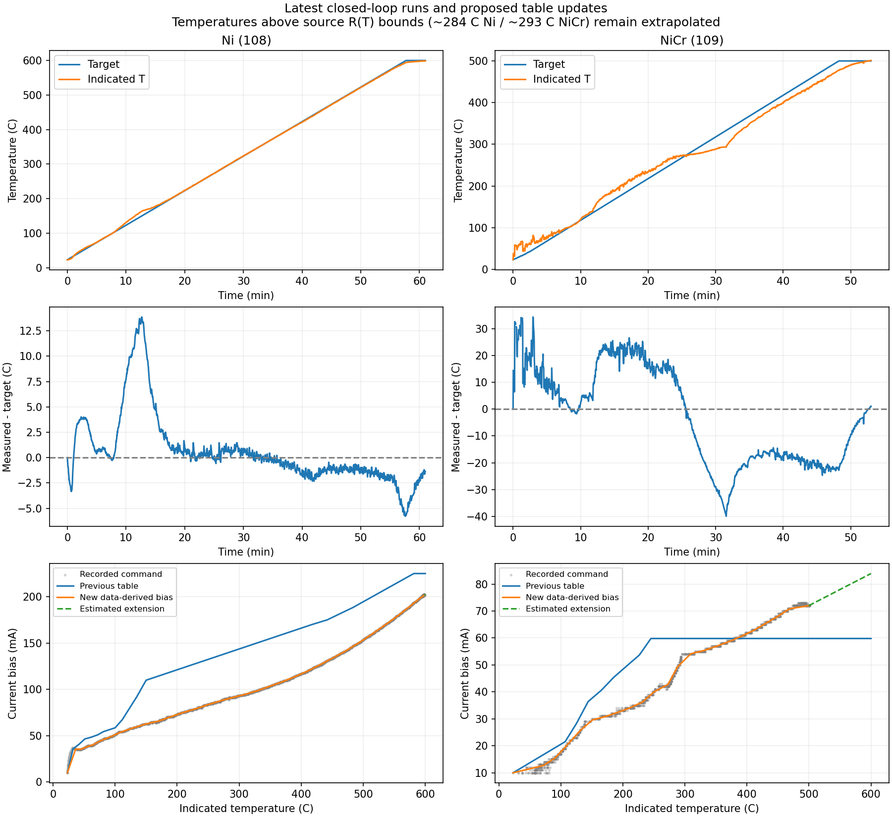

# Ni run 108 and NiCr run 109: September 23 update

The actual folders identify 108 as Ni and 109 as NiCr. The metadata confirms
the corresponding profile lineage. Original measurement files were not changed.

## Findings

Ni (108) ran for about 61 minutes, reached 598.63 C at a 600 C target, and had
no invalid cycles or current-limit events. Maximum measured current/power were
0.202925 A / 0.295999 W. The old run-100 current ceiling problem did not recur.
Its main overshoot was about +13.9 C around the 100-180 C segment, where the
previous fast-current-sweep table greatly exceeded the actual commanded current.
From 200-350 C, mean tracking error was about +0.4 to +0.5 C; from 400-550 C,
about -1.2 to -1.4 C. The final approach briefly lagged by about 5.8 C.

NiCr (109) ended at 501.08 C with a 500 C target. It had 16 invalid/held cycles
in the startup period and no current-limit events. Maximum measured current/power
were 0.074129 A / 0.127105 W. Errors reached about +26.6 C at intermediate
setpoints and -39.9 C near the 300-350 C setpoint interval. The old table was
too high in much of the lower range, then flat above 245 C. Large changing
integral corrections were consequently needed. This is consistent with a bad
feed-forward map, rather than evidence that larger PI gains are required.

The NiCr calibration file still warns of 20.24 C-equivalent T0 resistance scatter.
Updating a current table cannot independently correct that temperature uncertainty.
Both source R(T) references end near 284 C (Ni) / 293 C (NiCr): above those
bounds the indicated temperatures remain extrapolated.

## What changed

Both feed-forward tables now come from their respective 10 C/min closed-loop
runs, rather than Ni's fast current sweep or NiCr's old truncated table.
Current is associated with the logged indicated temperature, not with an unmet
setpoint. No new PI tuning or electrical limit increases are justified by these
runs; all gains, current steps, measurement guards and limits are preserved.

Selection excludes non-finite/non-positive readings, invalid diagnostic cycles,
the initial 60 s for Ni / 180 s for NiCr, and a meter-range change plus its next
two cycles. Ramp-only temperature bins use mean indicated T and RMS applied
command C_V. Small current reversals are made nondecreasing, with at most one
hardware current step of allowed correction; larger reversals fail validation.
The original 23 C / 10 mA startup anchor is retained as a command, not an
equilibrium measurement.

The last minute at the final target supplies a separate observed endpoint.
Neither endpoint is declared settled equilibrium: indicated T still rose about
0.79 C/min for Ni and 2.84 C/min for NiCr during this interval.

Ni's new table contains 35 points, reaching a 600 C estimate of 0.202568 A.
NiCr's contains 24 points, reaching a 600 C estimate of 0.083911 A. The extension
uses a linear fit of I squared versus T over the last four ramp bins, anchored
to the observed late-hold mean. Ni extends only about 598.32 to 600 C; NiCr
extends about 499.67 to 600 C and is substantially less certain. These sections
are labelled unmeasured in JSON provenance, not presented as new measurements.

Each JSON retains source hashes, bin counts, exclusions, late-hold trend and
extension method. These are provisional ramp biases, not independent calibration
or proof of future tracking accuracy.

## Selected interpolated table values

Values below are bias currents before PI correction (mA).

| Indicated T (C) | Ni (mA) | NiCr (mA) |
| --- | ---: | ---: |
| 100 | 51.079 | 17.790 |
| 150 | 62.723 | 29.440 |
| 200 | 72.842 | 33.115 |
| 300 | 93.037 | 51.995 |
| 400 | 116.748 | 61.620 |
| 500 | 153.437 | 72.039 |
| 600 | 202.568 | 83.911 |

## Next trial

Restart/reload the matching profile and recalibrate T. Zero with the wire cooled.
Retain 10 C/min for these tables. Ni remains limited to 0.31 A / 0.83 W;
NiCr remains at its existing profile limits of 0.10 A / 0.25 W. Although run 109
used manual ceilings of 1 A / 3 W, its actual currents and powers fit inside the
retained profile limits. The extrapolated NiCr bias also fits below the retained
95 mA increase guard; reaching 600 C still needs hardware verification.

Maximum Temperature remains 600 C for both profiles. A reading above that value
stops the run, even during a final hold. A target at the same value therefore has
no overshoot allowance. NiCr's noisy startup/calibration warning remains a separate
measurement issue and should not be interpreted as fixed by the new table.

Reproduce from the repository root:

    python tools/update_closed_loop_profiles.py --source T:/Monajem/tds_sofia

Validation: all 147 tests passed. Both profiles were rebuilt twice with identical
results, and comparison with the previous versions confirms only the current
tables and provenance changed. This is software/data validation, not a hardware
prediction of perfect tracking.

